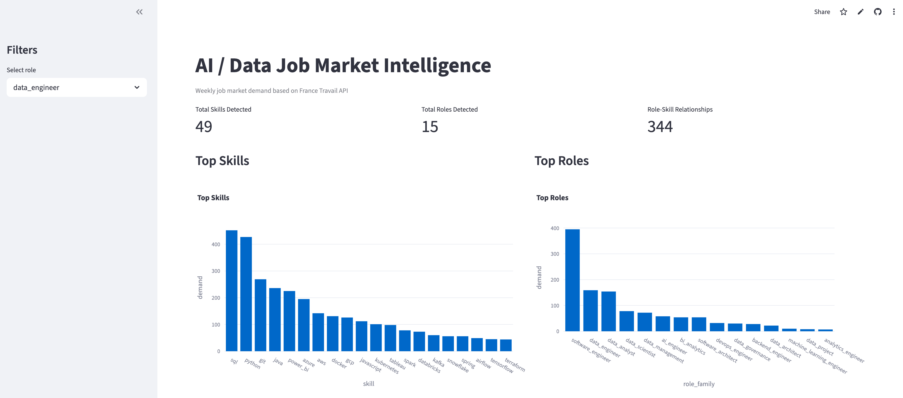
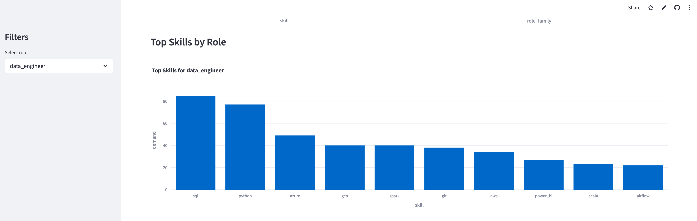
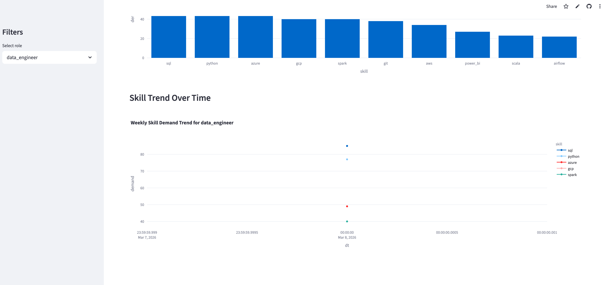

# AI Job Market Intelligence

AI Job Market Intelligence is an end-to-end data pipeline and analytics platform that tracks **technology job market demand** using public job postings from the **France Travail API**.

The project collects job offers weekly, transforms them into structured datasets, and surfaces insights through an interactive dashboard.

It demonstrates how a modern **analytics engineering stack** can transform raw job postings into meaningful labor-market intelligence.

---

# Dashboard Preview







---

# Project Goal

The goal of this project is to understand **technology job market demand** by answering questions such as:

- Which roles are most in demand?
- Which technical skills are growing?
- What skills are associated with each role?
- How does demand evolve over time?
- What seniority levels are most demanded?
- Which technical domains are associated with each role?

Beyond analytics, the project also demonstrates a **realistic analytics engineering architecture**.

---

# Key Features

- End-to-end data pipeline from API ingestion to analytics dashboard
- Automated weekly ingestion pipeline
- Raw data storage in AWS S3
- Snowflake data warehouse
- dbt transformation layer (staging → marts)
- Rule-based NLP enrichment for skills and job attributes
- Interactive analytics dashboard using Streamlit
- Time-series analysis of job market demand

---

# Architecture Overview
France Travail API
        │
        ▼
GitHub Actions
(weekly ingestion)
        │
        ▼
AWS S3
Raw JSON storage
        │
        ▼
Python Transformations
        │
        ▼
Snowflake Warehouse
STAGING.STG_OFFRES
        │
        ▼
dbt
Staging + Marts Layer
        │
        ▼
Streamlit
Analytics Dashboard


---

# Project Evolution

The project was intentionally built in **iterations**, each introducing new capabilities.

---

# V1 — MVP Data Pipeline

The first version focused on building a **complete end-to-end data pipeline**.

### Architecture

France Travail API  
↓  
GitHub Actions ingestion  
↓  
S3 raw JSONL storage  
↓  
Python transformations  
↓  
Analytics parquet datasets  
↓  
Streamlit dashboard

### Capabilities

- Weekly ingestion pipeline
- Raw data storage in S3
- Job description cleaning
- Skill extraction
- Role classification
- Aggregated analytics datasets
- Streamlit dashboard
- Automated GitHub Actions pipeline

### Generated datasets

- `skill_demand`
- `role_demand`
- `role_skill_demand`

---

# V1.1 — Enriched Insights

Version 1.1 introduced **rule-based NLP enrichment** to extract deeper insights from job descriptions.

### New inferred attributes

#### Seniority Level

- intern_apprentice  
- junior  
- mid  
- senior  
- lead  
- manager  
- architect_principal  

#### Domain Focus

- data_platform  
- bi_reporting  
- ml_ai  
- genai_llm  
- cloud_devops  
- data_governance_quality  
- embedded_iot  

### New analytics datasets

- `role_demand_by_seniority`
- `role_demand_by_domain_focus`

These enrichments allow deeper analysis of job market demand by **experience level and technical specialization**.

---

# V2 — Modern Analytics Platform

Version 2 transforms the project into a **modern analytics engineering platform** using a warehouse and transformation framework.

### V2 Architecture

France Travail API  
↓  
GitHub Actions ingestion  
↓  
AWS S3 raw storage  
↓  
Python staging transformations  
↓  
Snowflake `STAGING.STG_OFFRES`  
↓  
dbt staging model  
`STG_OFFRES_VIEW`  
↓  
dbt analytics marts  
↓  
Streamlit dashboard connected to Snowflake

---

# Technology Stack

### Data Ingestion

- Python
- France Travail API
- GitHub Actions

### Storage

- AWS S3

### Data Warehouse

- Snowflake

### Transformation Layer

- dbt

### Analytics / Visualization

- Streamlit
- Plotly

---

# Data Modeling

The analytics layer follows a **layered modeling architecture**.

---

## Staging Layer

Technical normalization layer.

Model:
stg_offres_view

Responsibilities:

- column normalization
- type casting
- base transformations

---

## Analytics Marts

Business-oriented datasets used by the dashboard.

### Core marts

- `mart_role_demand`
- `mart_skill_demand`
- `mart_role_skill_demand`

### Enriched marts

- `mart_role_demand_by_seniority`
- `mart_role_demand_by_domain_focus`
- `mart_skill_demand_by_role`

### Trend analysis marts

- `mart_skill_trends_by_month`
- `mart_role_trends_by_month`

These marts power the Streamlit analytics dashboard.

---

# Example Insights

Initial analysis reveals several patterns:

- Software engineering roles dominate overall demand
- Data analyst roles correlate strongly with BI tools
- Data engineering roles correlate with SQL, Python, Spark and cloud technologies
- AI engineering roles correlate with GenAI and ML topics
- Entry-level demand is highest for analyst-type roles

---

# Repository Structure
```text 
job-market-intel
│
├── dashboard
│   └── app.py
│
├── scripts
│   └── test_snowflake_connection.py
│
├── transformations
│   └── load_stage_to_snowflake.py
│
├── job_market_intel_dbt
│   ├── dbt_project.yml
│   ├── macros
│   │   └── generate_schema_name.sql
│   │
│   └── models
│       ├── staging
│       │   ├── stg_offres_view.sql
│       │   └── staging.yml
│       │
│       └── marts
│           ├── mart_role_demand.sql
│           ├── mart_skill_demand.sql
│           ├── mart_role_skill_demand.sql
│           ├── mart_role_demand_by_seniority.sql
│           ├── mart_role_demand_by_domain_focus.sql
│           ├── mart_skill_demand_by_role.sql
│           ├── mart_skill_trends_by_month.sql
│           ├── mart_role_trends_by_month.sql
│           └── marts.yml
```

---

# Running the Project

### Install dependencies
pip install -r requirements.txt

### Run ingestion pipeline
python scripts/run_weekly_pipeline.py

### Load data to Snowflake
python transformations/load_stage_to_snowflake.py

### Run dbt models
dbt run
dbt test

### Launch dashboard
streamlit run dashboard/app.py

---

# Limitations

The current system has several limitations:

- Role classification is rule-based
- Skill extraction relies on keyword matching
- Industry inference remains experimental
- Some job offers fall into the "other" category
- Historical data coverage is still limited
- Dashboard UX is intentionally simple

---

# Roadmap

## V3 — Advanced Analytics

Potential improvements:

- Skill demand growth analysis
- Time-series forecasting
- Industry segmentation
- Geographic job market analysis

---

## V4 — AI Job Market Copilot

Long-term vision:

- LLM-powered job market assistant
- Natural language analytics queries
- Automated labor-market insights
- AI-generated reports

---

# Why This Project Matters

This project demonstrates how to build a **modern analytics engineering pipeline**:

- API ingestion
- data lake storage
- warehouse analytics
- dbt transformation layers
- dashboard consumption

It illustrates how data teams transform **unstructured real-world data into decision-ready analytics datasets**.